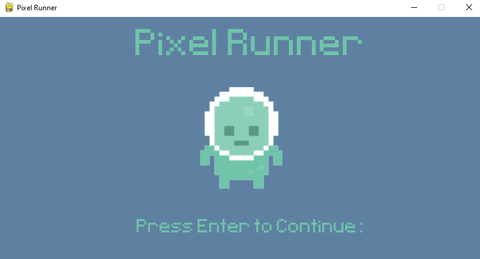
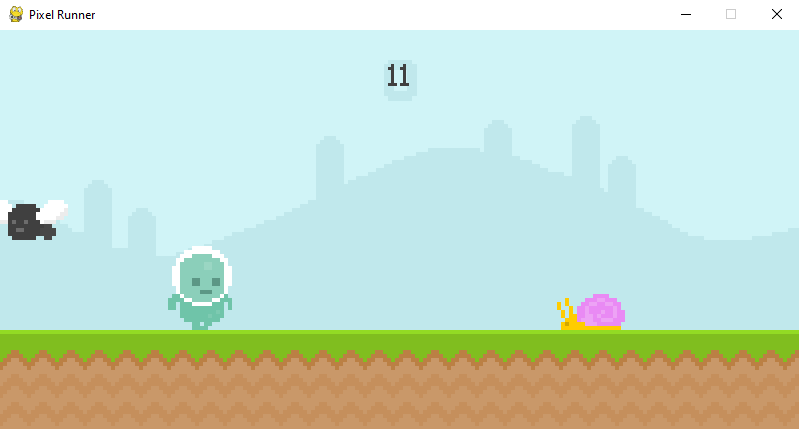
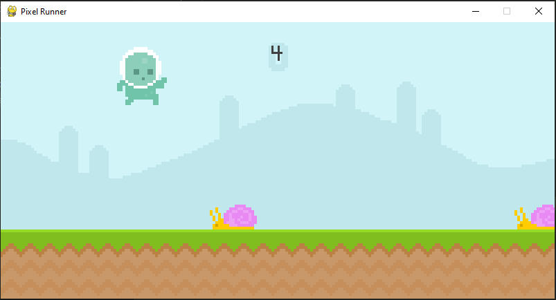
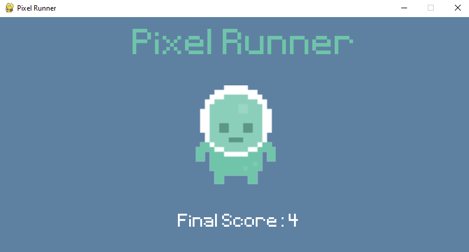

# PixelRunner
 
 This is a game i created called 'Pixel Runner' while following along a tutorial.
 It is the first game i have created using python and i achieved it by using the pygame module.
 The main purpose of this project was for me to understand the basics of pygame and to give myself some practice with it.
 ## Screenshots
 
 
 
 
 ## Controls
|  | Button |
--- | --- |
Start game | ENTER |
Jump | SPACEBAR |
